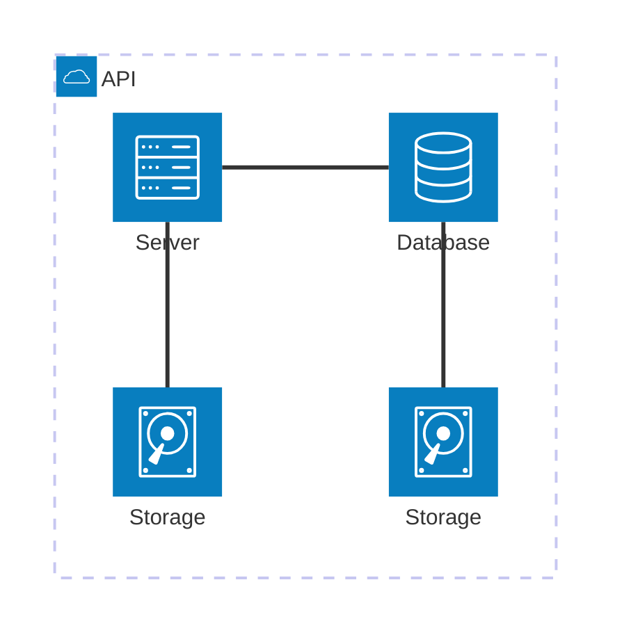

# Confidential Containers Hands-On

This repository provides an automated setup to get started testing [confidential containers](https://confidentialcontainers.org/) with [kind](https://kind.sigs.k8s.io/) and [codespaces](https://docs.github.com/en/codespaces). It includes pre-configured cluster configurations, operator deployments, and demo workloads to help you quickly explore confidential containers technology in a local development environment.

## Quickstart

To get started quickly, fork this repository and create a codespaces instance. In a few short moments you should be able to run the setup script (./start-demo) in the new codespace. From there you can install the necessary components all at once by selecting `Full Send!` or step by step.

If you don't have access to remote codespaces, this demonstration can be run locally as well using VSCode, the [Dev Containers extension](https://marketplace.visualstudio.com/items?itemName=ms-vscode-remote.remote-containers), and a container runtime.

## Overview

The general process for this demonstration is:
* Setup Cluster Prerequisites
  * [Operator Lifecycle Manager](https://github.com/operator-framework/operator-lifecycle-manager)
* Setup the confidential container runtime
  * [Confidential Containers Operator](https://github.com/confidential-containers/operator)
* Setup the trustee key broker services
  * [Trustee Operator](https://github.com/confidential-containers/trustee-operator)
* Install several (6) demo pods to demonstrate policy and secret management.

## Architecture

## Demo Overview

### Demo 1: Alternative Runtime

Demonstrates that a runtime other than containerd can successfully provision a workload.

### Demo 2: Runtime Policy

Demonstrates that runtime policy can be passed through annotations to do things like prevent remote execution.

### Demo 3: Attestation

Demonstrates that metadata is leveraged for attestation with the attestation server.

### Demo 4: Confidential Data Hub

Demonstrates that a workload can call a local service to request information from the confidential data hub.

### Demo 5: Secret Management

Demonstrates that you can pull secrets when the right policy is enabled.

### Demo 6: Sealed Secrets

Demonstrates that you can use sealed secrets as a mechanism to keep your secrets within your trusted compute boundary.

## Notes

The original inspiration for this content is [here](https://confidentialcontainers.org/blog/2024/12/03/confidential-containers-without-confidential-hardware/)

